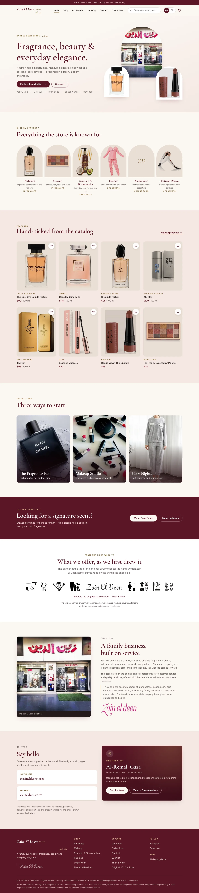
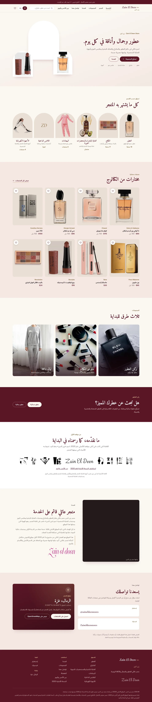
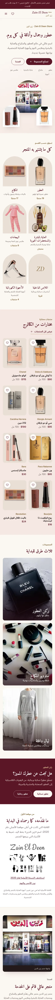
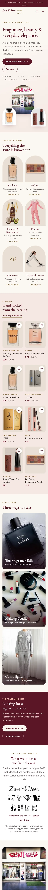
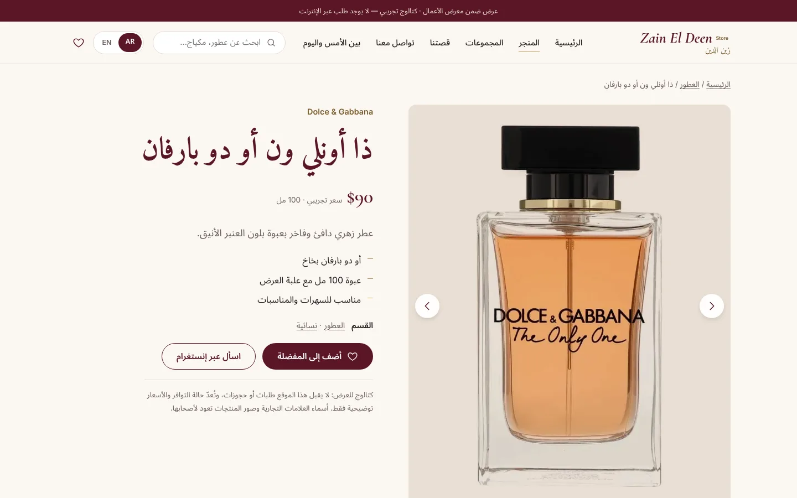
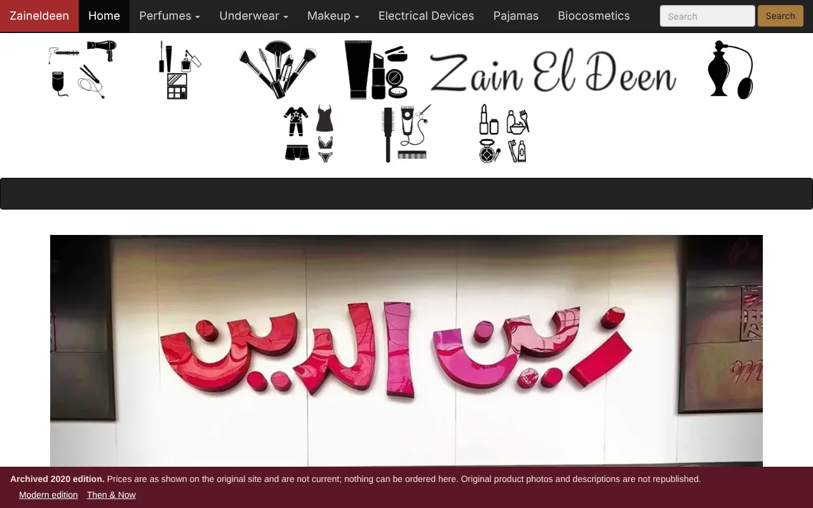
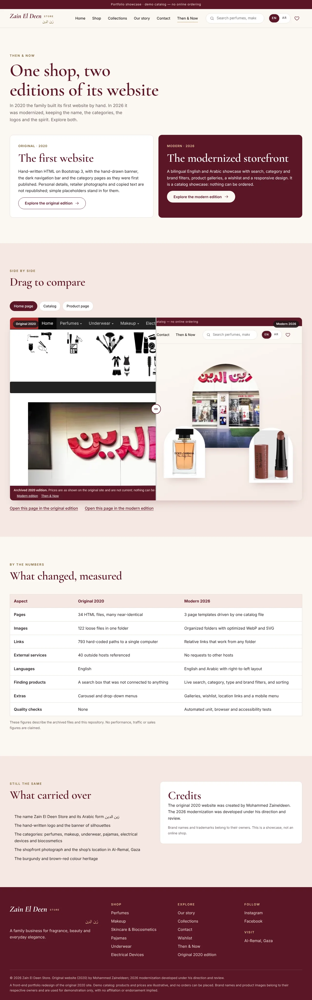
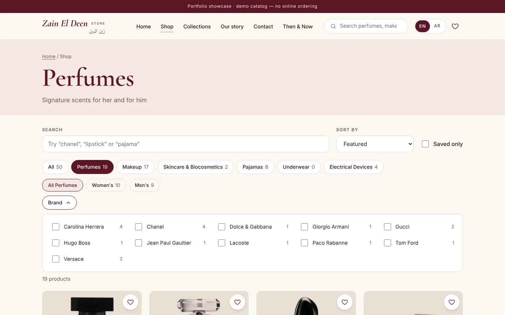

# Zain El Deen Store — bilingual storefront showcase

A modern, responsive, **English and Arabic** storefront front end for **Zain El Deen Store** (زين الدين), a family business offering perfumes, makeup, skincare, pajamas and personal-care devices.

| English | العربية (RTL) |
| --- | --- |
|  |  |

**Live website:** https://mohammedszd.github.io/zaineldeen-store-showcase/ (published through GitHub Pages; see [Deployment](#deployment))


## Background

This is the second chapter of my **first complete website**, built in 2020 for my family's shop. The original was a set of hand-written HTML pages on Bootstrap 3. The original version is kept as a private family archive.

This version modernizes it into a portfolio-quality project while keeping the identity: the Zain El Deen name, the Arabic wordmark, the original script logo and shopfront photo, the burgundy colour heritage and the original category structure (perfumes, makeup, underwear, pajamas, electrical devices, biocosmetics/skincare).

The original 2020 website was created by Mohammed Zaineldeen. The 2026 modernization was developed under his direction and review.

## Two editions

| Edition | What it is | Where |
| --- | --- | --- |
| **Original 2020 (Legacy Showcase)** | The first website's look, navigation, colours, logos, category structure and banner, as a static archive. Private details, retailer photographs and copied text are replaced with simple placeholders; nothing can be ordered. See [docs/legacy-showcase.md](docs/legacy-showcase.md) | `public/legacy/`, served at `/legacy/` |
| **Modern 2026** | The bilingual storefront described below | `index.html`, `shop.html`, `product.html` |

The [Then & Now](then-and-now.html) page compares them side by side, with a before/after slider, a table of measured differences, and links to explore both. Its screenshots are regenerated with `npm run capture:then-now`.

## Modernization goals

- A premium, elegant look appropriate to fragrance and beauty retail.
- Replace ~30 copy-pasted pages and 120 oddly named images with a small, data-driven, maintainable code base.
- English by default with a complete, natural Arabic version and proper right-to-left layout.
- Fast, accessible, responsive, free of trackers, and deployable to any static host.
- Protect privacy: personal details from the early student version are not part of the new site.

## Features

- **Home:** hero built around the real shopfront photo, category navigation, featured products, collections, promotional band, the restored original banner, family story, contact and location section, footer.
- **Heritage banner:** the header strip from the original 2020 website (the hand-written Zain El Deen name between eight black silhouette icons) is restored from the archived files, unchanged, in its original order, and scales from desktop to mobile.
- **Catalog:** live search, category and sub-category filters, a **brand filter**, sorting (featured, price, name), result counts, shareable URLs such as `shop.html?cat=perfumes&brand=chanel,dolce-gabbana&sort=price-asc`.
- **Brand filter:** brands are derived from the product data, so only brands that exist in the current category, type, search and saved view are listed, each with an accurate count. Multiple brands can be selected, removed one by one or cleared, and selections combine with category, type, search and sorting. Choosing another category drops brands that do not exist there. Labels are translated and the panel follows the reading direction; brand names stay in Latin script as on the packaging, and Arabic transliterations are searchable.
- **Product pages:** image gallery (buttons, thumbnails and arrow keys that respect text direction), details, related products.
- **Wishlist:** saved in `localStorage`, synced across tabs, with a "saved only" view.
- **Location:** the shop's map pin as a directions link (Google Maps) and an OpenStreetMap link. No map is embedded, so no third-party scripts load.
- **Accessibility:** skip link, visible focus, ARIA state on toggles and live results, keyboard-operable menu, chips and gallery, reduced-motion support, correct `lang` and `dir`.
- **Performance and privacy:** self-hosted fonts, WebP images with `srcset`, lazy loading, no analytics, no CDNs, no third-party requests.
- **Image rights by construction:** the production build bundles only the business's own photo and logos, original illustrations, and photographs registered with documented evidence (owner-authorized photos from the original site). A test fails if anything else reaches `dist/`.

## English / Arabic

- English is the default; Arabic is one click away through the **EN / AR** switch in the header (inside the menu on very small screens).
- The choice is stored in `localStorage`; `?lang=ar` or `?lang=en` in a URL overrides it, so Arabic links can be shared.
- The whole interface is translated, including product names and descriptions, categories, filters, empty states, promotional text, contact and footer. Search works in both languages and finds the same product from either (`nightshirt` / `قميص نوم`), including spelling variants of Arabic letters.
- Switching happens in place: no reload, filters and gallery position are kept. `<html lang>` and `dir` are updated, layouts use CSS logical properties, directional icons mirror, and Arabic typography avoids letter-spacing and uppercase transforms.
- Fonts: Cormorant Garamond and Inter for Latin text; Amiri and Noto Sans Arabic for Arabic.
- Brand wordmarks are identical in both languages. Brand names in product listings stay in Latin script, as on the packaging.
- The Arabic copy was written for this project; a native-speaker review is recommended before launch.

| Arabic mobile | English mobile | Product (Arabic) |
| --- | --- | --- |
|  |  |  |

More: [heritage banner (EN)](docs/screenshots/heritage-banner-desktop-en.webp), [heritage banner (AR)](docs/screenshots/heritage-banner-desktop-ar.webp), [heritage banner on mobile](docs/screenshots/heritage-banner-mobile-en.webp), [brand filter on desktop (EN)](docs/screenshots/shop-brands-desktop-en.webp), [brand filter on desktop (AR)](docs/screenshots/shop-brands-desktop-ar.webp), [brand filter on mobile (EN)](docs/screenshots/shop-brands-mobile-en.webp), [brand filter on mobile (AR)](docs/screenshots/shop-brands-mobile-ar.webp), [catalog (EN)](docs/screenshots/shop-desktop-en.webp), [catalog (AR)](docs/screenshots/shop-desktop-ar.webp), [product (EN)](docs/screenshots/product-desktop-en.webp), [contact and location (EN)](docs/screenshots/contact-location-en.webp), [contact and location (AR)](docs/screenshots/contact-location-ar.webp).

### Three ways to see the project

| Original 2020 (Legacy Showcase) | Then & Now | Catalog with brand filter |
| --- | --- | --- |
|  |  |  |

## Technology

- HTML, CSS (custom properties and logical properties, no framework) and vanilla JavaScript (ES modules)
- [Vite](https://vite.dev/) for the dev server, bundling and hashed assets
- [Fontsource](https://fontsource.org/) self-hosted fonts
- Node's built-in test runner and Playwright for tests

## Project structure

```
index.html, shop.html, product.html, then-and-now.html   Entry pages (head, header and footer come from src/partials)
src/
  i18n/        en.js, ar.js (all UI strings), index.js (language, plurals, meta tags)
  data/        categories.js, products.js + products.ar.js (demo catalog), business.js (public business details)
  lib/         catalog.js (bilingual search/filter/sort), wishlist.js, images.js, labels.js, dom.js
  components/  layout.js (menu, language switch, wishlist badge, location links), productCard.js
  pages/       home.js, shop.js, product.js, then-and-now.js
  partials/    head.html, header.html, footer.html
  styles/      tokens, base, layout, components, pages
assets/images/ branding/, heritage/, then-now/, illustrations/, licensed/ (WebP and SVG)
public/        favicons, Open Graph image, robots.txt, legacy/ (the sanitized original 2020 edition)
tests/         unit/ (catalog, i18n, privacy), e2e/ (browser tests in both languages)
docs/          screenshots/, image-sources.md, photo-acquisition-checklist.md, photo-shot-list.csv, photo-intake-template.csv
scripts/       generate-illustrations.mjs, add-licensed-image.mjs
```

## Getting started

```bash
npm install
npm run dev                 # local dev server
npm run build               # production build in dist/
npm run illustrations       # regenerate the original illustrations
npm run image:add -- …      # register one licensed photo (see docs/image-sources.md)
npm run image:batch -- f.csv # register many photos from a CSV (docs/photo-intake-template.csv)
npm run shotlist            # refresh docs/photo-shot-list.csv
npm run capture:then-now    # refresh the Then & Now screenshots (build first)
npm run preview             # serve the build
npm test                    # unit tests
npm run test:e2e            # browser tests (run `npm run build` first)
```

Adding or editing a product: edit `src/data/products.js` and its Arabic text in `src/data/products.ar.js`, and add `<id>-1-480.webp` / `<id>-1-960.webp` (4:5) under `assets/images/products/`. Tests check translations, categories and image files.

## Testing

`npm test` runs 40 unit tests: bilingual search, filters, brand facets and filtering, sorting, dictionary parity (every English key has an Arabic one, with matching placeholders and Arabic plural forms), complete Arabic copy for every product, image rights rules (nothing unregistered is bundled), the Legacy Showcase rules (no outside hosts, personal data or template content; every link resolves), and a privacy scan that fails on phone numbers, e-mail addresses, password values or tracking scripts in the source, docs and production build.

`npm run test:e2e` drives Chromium through the production build in English and Arabic: navigation and internal links, search, filters, sorting, product gallery, wishlist persistence, language switching and direction changes, the mobile menu, keyboard access, automated accessibility checks (axe-core, WCAG 2.1 A/AA), the location and social links, broken images, which images are requested, the licensed-photo pipeline (exercised with synthetic photos on a temporary copy of the project), console errors, unexpected external requests, and horizontal overflow at 320, 375, 430, 768, 1024, 1440 and 1920 px.

## Deployment

The build uses a relative base path, so `dist/` works from any folder, including a GitHub Pages project site, with no server rules. For canonical, hreflang and Open Graph image URLs, build with an absolute site URL (with trailing slash):

```bash
SITE_URL=https://example.com/zaineldeen-store/ npm run build
```

The workflow `.github/workflows/pages.yml` runs the tests, builds with `SITE_URL` set from the repository name, writes `sitemap.xml` and a `robots.txt` that points to it, and publishes to GitHub Pages. It is started manually (Actions tab, "Deploy to GitHub Pages") after enabling Settings, Pages, Source: GitHub Actions. All asset paths are relative, so the site works under the `/<repository-name>/` path. The Legacy Showcase pages carry `noindex` and are left out of the sitemap.

Without `SITE_URL`, those tags are omitted rather than emitted with wrong URLs. 
## Limitations

- **Not a real shop.** No checkout, payment, accounts, inventory, delivery or reservations, and none is implied. "Ask on Instagram" opens the store's public profile.
- **Demo data.** Prices are illustrative and availability is not modelled. Descriptions were written for this showcase.
- **Imagery.** 38 of the 50 products and the three collections use photographs from the original 2020 website, published with the owner's confirmed permission. The other 12 products show clearly labelled original illustrations until photographs exist (listed in [docs/image-sources.md](docs/image-sources.md)). `npm run image:add` / `image:batch` register further photos with their source and licence. Brand names belong to their owners; no affiliation or endorsement is implied.
- **Banner artwork.** The silhouette icons in the restored banner come from the original site; their origin is not documented and needs the owner's confirmation.
- **Location and business details** come from the original 2020 site and need the owner's confirmation. Opening hours and phone numbers are intentionally not shown.
- Several categories (underwear, some makeup types) have no products because the original had no content for them; they show a "coming soon" state.
- Product pages are client-rendered from a query string, so link previews use the generic site preview.
- Not yet verified: real devices, Safari and Firefox, screen readers, Lighthouse scores, and a native Arabic proofread.
